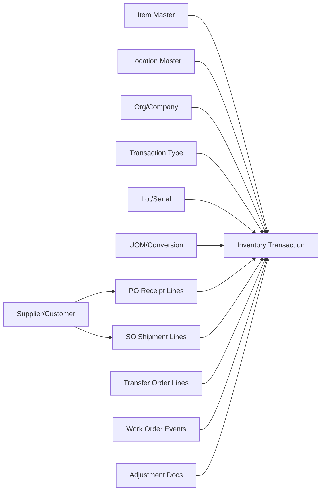

-- explain the schema and relationships of the inventory management data models in Documentation\Schema\Data_Models\Inventory_Transactions
The inventory management data models in the "Inventory_Transactions" schema are designed to track and manage inventory transactions within a business. The key tables in this schema include:   
1. **Inventory_Transactions**: This is the central table that records all inventory transactions. It includes fields such as TransactionID, ProductID, Quantity, TransactionType (e.g., purchase, sale, return), TransactionDate, and other relevant details.
2. **Products**: This table contains information about the products in the inventory. It includes fields such as ProductID, ProductName, Category, Price, and SupplierID.
3. **Suppliers**: This table holds information about the suppliers that provide products to the business. It includes fields such as SupplierID, SupplierName, ContactInfo, and Address.
4. **Inventory_Balance**: This table maintains the current balance of   
   inventory for each product. It includes fields such as ProductID, QuantityOnHand, and
   LastUpdated.
The relationships between these tables are as follows:
- The **Inventory_Transactions** table has a foreign key relationship with the **Products** 
table through the ProductID field, allowing it to reference the specific product involved 
in each transaction.
- The **Products** table has a foreign key relationship with the **Suppliers** table through the SupplierID field, enabling it to reference the supplier of each product.
- The **Inventory_Balance** table also has a foreign key relationship with the **Products** 
table through the ProductID field, allowing it to maintain the current inventory balance for each product.
Overall, these tables and their relationships enable the business to effectively manage and
 track inventory transactions, monitor product information, and maintain supplier details.

An active connection is required for GitHub Copilot to understand your database schema and proceed.
Select "Open SQL editor and connect" to establish a connection.

Open SQL editor and connect

For an **inventory transaction schema**, “upstream relationships” are usually the master and document tables that create each movement row.

### Typical upstream entities

- **Item/Product master** → defines SKU, category, default UOM.
- **Location/Warehouse/Bin master** → where stock moves from/to.
- **Organization/Company** → legal entity / business unit context.
- **Lot/Serial master** (optional) → traceability keys.
- **Transaction type master** → receipt, issue, transfer, adjustment, return.
- **Document headers/lines** that trigger movement:
  - Purchase receipts (PO)
  - Sales shipments/returns (SO/RMA)
  - Transfer orders
  - Work orders / production consumption & completion
  - Cycle count / manual adjustment docs
- **Party master** (supplier/customer) via source docs.
- **UOM conversion** and sometimes **currency/rate** tables.
- **User/employee** and **reason codes** for audit.

### Common relationship pattern

- `inventory_transaction` is the central fact/event table.
- It has many-to-one links to dimensions (`item_id`, `location_id`, `txn_type_id`, `org_id`, `lot_id`, `uom_id`).
- It also links back to source document context (`source_doc_type`, `source_doc_id`, `source_line_id`).

### Minimal key set in transaction table

- Business keys: `item_id`, `org_id`, `location_id`
- Event keys: `txn_datetime`, `txn_type_id`, `quantity`, `uom_id`
- Trace keys: `lot_id` / `serial_id`
- Lineage keys: `source_doc_type`, `source_doc_id`, `source_line_id`

If needed, share your actual table names/DDL for a precise upstream map.