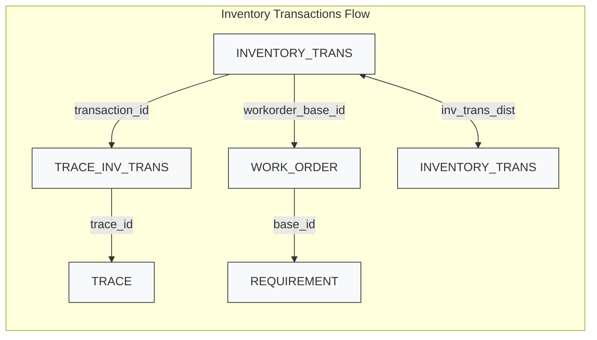

This diagram shows the common join path used in reports: INVENTORY_TRANS -> TRACE_INV_TRANS -> TRACE. `INV_TRANS_DIST` links paired IN/OUT transactions when present.
## Inventory Transactions Flow

work_order
join operation
...
and o.WORKORDER_SUB_ID = a.SUB_ID
join REQUIREMENT
...
-- > subordinate work order link:
and o.WORKORDER_SUB_ID = ISNULL(r.SUBORD_WO_SUB_ID, 0)

## inventory_transactions_flow
select 1 --. . .
from inventory_trans t ---, warehouse w, location l
  join dbo.warehouse w
  on w.id = t.warehouse_id
  join dbo.[location] l
  on w.id = l.warehouse_id
  and t.location_id = l.id
  LEFT JOIN TRACE_INV_TRANS ti WITH (NOLOCK)
  ON ti.TRANSACTION_ID = t.TRANSACTION_ID
  LEFT JOIN TRACE tr WITH (NOLOCK)
  ON tr.ID = ti.TRACE_ID

where t.class IN ( 'i' , 'r' )
  AND t.type IN ( 'i' , 'r' ) 
    AND ( T.SITE_ID IN ( N'SK01' ) )