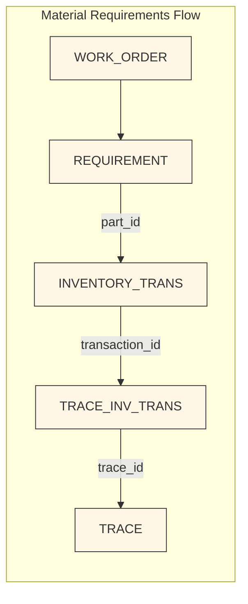

This diagram illustrates how material requirements connect to inventory and trace data.
# material requirements flow

-- 1) **inventory transaction flow**
  - inventory_transactions_flow.md
from #inventory_trans i

  -- 2) **work order operatioopns flow**
  inner 
  join dbo.WORK_ORDER a
  on i.WORKORDER_BASE_ID=a.BASE_ID
    and i.WORKORDER_LOT_ID=a.LOT_ID and
    i.WORKORDER_SPLIT_ID = a.SPLIT_ID

  INNER JOIN OPERATION o
  on o.WORKORDER_BASE_ID=a.BASE_ID and o.WORKORDER_LOT_ID=a.LOT_ID and
    o.WORKORDER_SPLIT_ID = a.SPLIT_ID
    and o.WORKORDER_SUB_ID = a.SUB_ID

-- 3) 
## materials requirement flow ##
- (subordinate work order link)
  inner join REQUIREMENT r WITH (NOLOCK)
  on i.part_id = r.part_id
    and o.WORKORDER_BASE_ID=r.WORKORDER_BASE_ID and o.WORKORDER_LOT_ID=r.WORKORDER_LOT_ID and
    o.WORKORDER_SPLIT_ID = r.WORKORDER_SPLIT_ID and o.SEQUENCE_NO = r.OPERATION_SEQ_NO
    and o.WORKORDER_SUB_ID = ISNULL(r.SUBORD_WO_SUB_ID, 0)