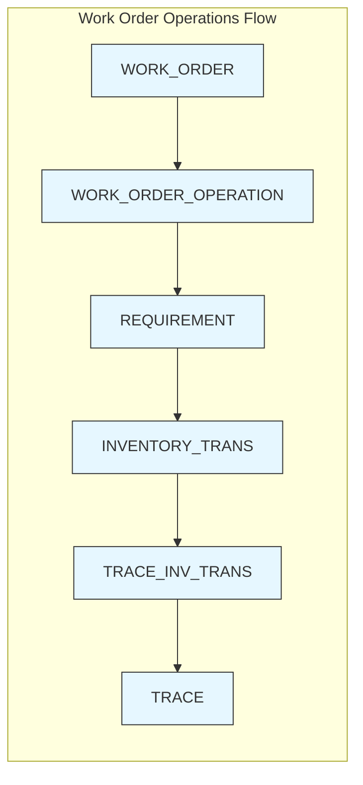

This diagram captures work order -> operations -> requirement -> inventory -> trace chain.
## work order operations flow
- perspective: inventory transactions

```
-- inventory transaction flow
from #inventory_trans i
  -- **work order operatioopns flow**
  inner 
  join dbo.WORK_ORDER a
  on i.WORKORDER_BASE_ID=a.BASE_ID
    and i.WORKORDER_LOT_ID=a.LOT_ID and
    i.WORKORDER_SPLIT_ID = a.SPLIT_ID


  INNER JOIN OPERATION o
  on o.WORKORDER_BASE_ID=a.BASE_ID and o.WORKORDER_LOT_ID=a.LOT_ID and
    o.WORKORDER_SPLIT_ID = a.SPLIT_ID
    and o.WORKORDER_SUB_ID = a.SUB_ID
```