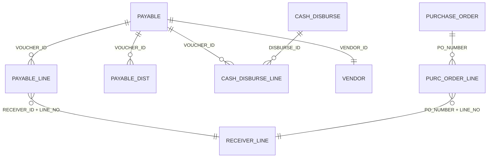

```mermaid
erDiagram
    PAYABLE ||--o{ PAYABLE_LINE : "VOUCHER_ID"
    PAYABLE ||--o{ PAYABLE_DIST : "VOUCHER_ID"
    PAYABLE_LINE }o--|| RECEIVER_LINE : "RECEIVER_ID + LINE_NO"
    PAYABLE ||--o{ CASH_DISBURSE_LINE : "VOUCHER_ID"
    CASH_DISBURSE ||--o{ CASH_DISBURSE_LINE : "DISBURSE_ID"
    PAYABLE ||--|| VENDOR : "VENDOR_ID"
    PURCHASE_ORDER ||--o{ PURC_ORDER_LINE : "PO_NUMBER"
    PURC_ORDER_LINE }o--|| RECEIVER_LINE : "PO_NUMBER + LINE_NO"

    %% Notes:
    %% - Prefer system-key joins (VOUCHER_ID, RECEIVER_ID+LINE_NO) over vendor-supplied invoice numbers.
    %% - Some fields (RECEIVER_LINE.INVOICE_ID) can be NULL; use receiver keys for reliable joins.
```

Brief: Logical Payables ER with composite join keys (for documentation).
