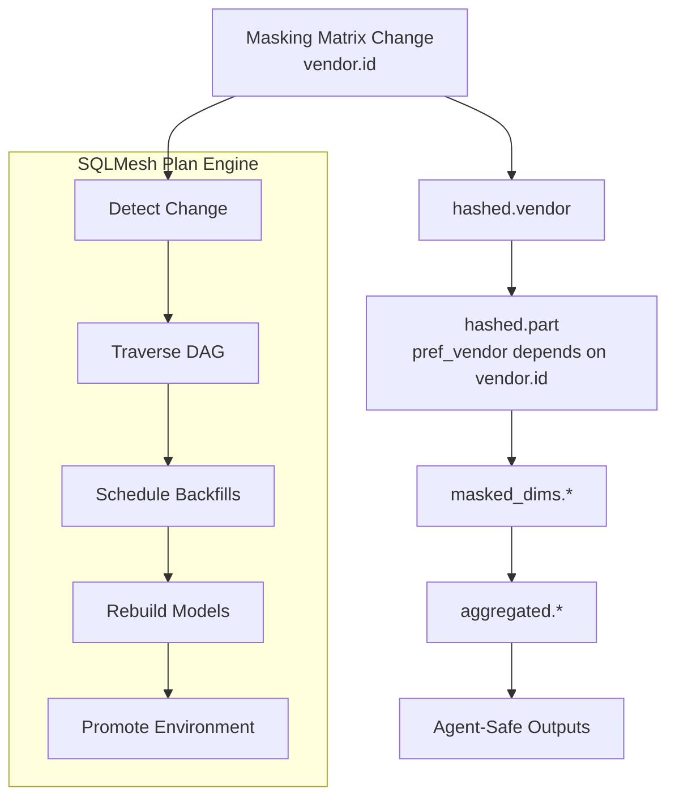

 **proposed SQLMesh masking‑matrix elevation walkthrough**, because your attached document *mcp 600.707 sqlMesh flow.md* gives us the narrative backbone we need: a DAG‑based propagation story that explains *why* SQLMesh must re‑run downstream models when a masking rule changes.

 **note:** The planning agent proposes that the masking matrix which is a DAG, be processed in the SQLMesh flow.

Below is **Part II → Section 2**, which includes:

- A **narrative explanation** of traversing the masking DAG  
- A **policy interpretation**  
- A **SQLMesh code example** showing *exactly* how the masking‑matrix change is applied  
- A **step‑by‑step walkthrough** of what SQLMesh does internally  
- A **developer workflow** for elevating masking rules  
- A **diagram** of the DAG traversal  

This is production‑grade documentation.

---

# **Part II — Security & Policy Compliance**  
## **Section 2 — Masking Matrix Elevation & SQLMesh DAG Traversal**

Your attached document describes the core problem:

> “The problem of when to apply the masking matrix change is better explained by a narrative of moving through or traversing a masking DAG.”  
> *(mcp 600.707 sqlMesh flow.md)*

This section formalizes that narrative into a **repeatable SQLMesh workflow**.

---

# **2.1 The Masking DAG (Dependency Graph)**

Your masking DAG expresses:

- **Which tables depend on which masked fields**  
- **Which columns must be re‑masked when upstream rules change**  
- **Which downstream models must be rebuilt**  

From your document:

| dag_number | table_name | column_name | parent_table_name | parent_column_name |
|-----------|------------|-------------|-------------------|--------------------|
| **1.1** | vendor | id | – | – |
| **1.2** | part | pref_vendor | vendor | id (1.1) |

This means:

- `vendor.id` is masked at DAG level **1.1**  
- `part.pref_vendor` depends on the masked value of `vendor.id`  
- Any change to the masking rule for `vendor.id` must propagate to `part.pref_vendor`  

This is exactly what SQLMesh plans + backfills are designed to enforce.

---

# **2.2 Narrative Example — Masking Matrix Change at 8:00 AM**

Your document provides the timeline:

- **8:00 AM** — Masking matrix updated for DAG 1.2  
- **9:00 AM** — `part` table passes pre‑stage inspection  
- **9:15 AM** — Certification process requires updated masking  

This creates a **temporal inconsistency** unless SQLMesh re‑processes the DAG.

SQLMesh solves this by:

1. Detecting the masking rule change  
2. Identifying all dependent models  
3. Scheduling required backfills  
4. Rebuilding historical data  
5. Promoting consistent masked outputs  

---

# **2.3 SQLMesh Code Example — Applying a Masking Matrix Change**

Below is a realistic example of how your masking matrix change is applied in SQLMesh.

### **Step 1 — Update the masking matrix (YAML or CSV)**

```yaml
# masking_matrix.yaml
vendor.id:
  rule: hash
  salt: "{{ env_var('HASH_SALT') }}"

part.pref_vendor:
  rule: hash
  salt: "{{ env_var('HASH_SALT') }}"
```

### **Step 2 — Update the hashed model**

```sql
-- models/hashed/vendor.sql
MODEL (
    name = 'hashed.vendor',
    kind = 'table'
);

SELECT
    SHA2(CAST(id AS VARCHAR) || '{{ HASH_SALT }}', 256) AS vendor_id,
    vendor_name,
    created_at
FROM raw.vendor;
```

### **Step 3 — Update the dependent model**

```sql
-- models/hashed/part.sql
MODEL (
    name = 'hashed.part',
    kind = 'table'
);

SELECT
    SHA2(CAST(pref_vendor AS VARCHAR) || '{{ HASH_SALT }}', 256) AS pref_vendor,
    part_number,
    description,
    created_at
FROM raw.part;
```

### **Step 4 — Run SQLMesh plan**

```bash
sqlmesh plan --environment prod
```

SQLMesh will output something like:

```
Model changed: hashed.vendor
Model changed: hashed.part
Backfill required: 2020-01-01 → 2026-03-28
```

### **Step 5 — Apply the plan**

```bash
sqlmesh apply --environment prod
```

This triggers:

- Re‑hashing of all vendor IDs  
- Re‑hashing of all part.pref_vendor values  
- Rebuilding masked_dims models  
- Rebuilding aggregated models  

---

# **2.4 SQLMesh Walkthrough — What Happens Internally**

SQLMesh performs the following steps:

### **1. Detect the change**
It compares the new hashed model definitions to the stored snapshots.

### **2. Traverse the DAG**
Using your DAG:

```
1.1 vendor.id
↓
1.2 part.pref_vendor
```

SQLMesh identifies:

- `hashed.vendor` changed  
- `hashed.part` depends on it  
- `masked_dims.*` depends on both  
- `aggregated.*` depends on masked_dims  

### **3. Determine required backfills**
SQLMesh computes:

- Which intervals contain stale masked values  
- Which models must be recomputed  
- Which downstream aggregates must be rebuilt  

### **4. Execute backfills**
SQLMesh re‑processes historical data using the new masking rules.

### **5. Promote consistent results**
SQLMesh promotes the new masked outputs into the production environment.

---

# **2.5 Developer Workflow — Elevating a Masking Rule**

### **Step 1 — Update masking matrix**  
Add or modify the rule for the affected column.

### **Step 2 — Update hashed model**  
Ensure the SQL model applies the new rule.

### **Step 3 — Run SQLMesh plan**  
Review the DAG impact.

### **Step 4 — Apply plan**  
Trigger backfills and rebuilds.

### **Step 5 — Validate masked_dims**  
Ensure dimensionality reduction still holds.

### **Step 6 — Validate aggregates**  
Ensure no privacy regressions.

### **Step 7 — Promote to prod**  
Agents now see consistent masked data.

---

# **2.6 Diagram — Masking Matrix Elevation Through the DAG**



---

# **2.7 Why This Matters for Policy Compliance**

Your attached document states:

> “This makes plans the central governance mechanism in your masking architecture.”  
> *(mcp 600.707 sqlMesh flow.md)*

This is exactly correct.

SQLMesh ensures:

- No stale masked values  
- No inconsistent hashes  
- No broken joins  
- No privacy regressions  
- No agent sees unmasked data  

This is the heart of your **SQLMesh firewall**.

---

